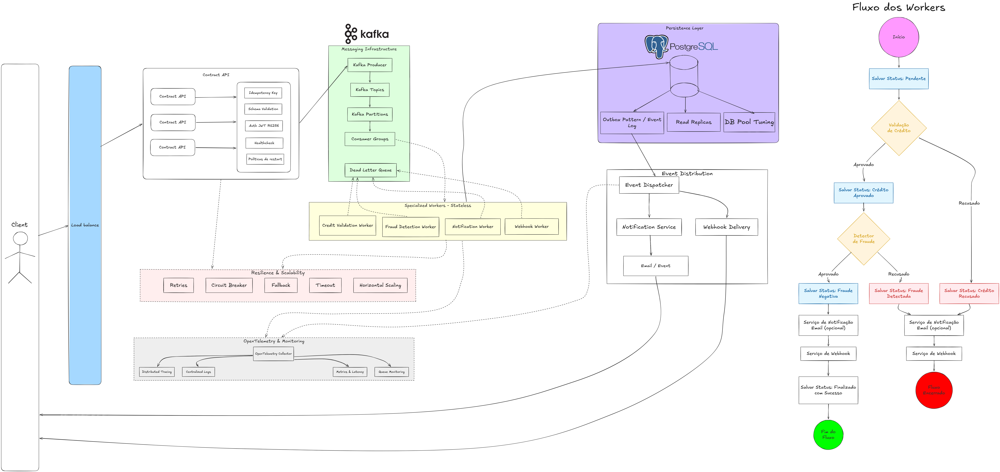

# fin-loans-contract-processor

> Motor de decisão e processamento de contratos de empréstimos financeiros, orientado a eventos, projetado para suportar alta volumetria com escalabilidade horizontal.

---

## Sobre o projeto

O **fin-loans-contract-processor** é um sistema backend de processamento de contratos financeiros capaz de lidar com **+10 milhões de requisições por dia**. Ele recebe contratos de crédito, executa validações de negócio e antifraude, persiste os dados e notifica os produtos cadastrados via webhook — tudo de forma assíncrona e resiliente.

O projeto está atualmente na fase de **arquitetura e design**, com toda a estrutura técnica definida antes da implementação, garantindo decisões sólidas desde o início.

---

## Funcionalidades

- Recebimento e validação de contratos de crédito
- Validações de negócio (ex: CPF válido, data de desembolso não retroativa)
- Análise de crédito assíncrona via workers especializados
- Detecção de fraude integrada ao fluxo de processamento
- Persistência de contratos e histórico de status no banco de dados
- Envio de webhooks e notificações por e-mail para produtos cadastrados
- Retorno detalhado dos motivos de rejeição por contrato

---

## Arquitetura

O sistema foi projetado como um **monolito modular orientado a eventos**, utilizando princípios de **Arquitetura Hexagonal** e **Clean Architecture**. Essa abordagem reduz a complexidade operacional inicial sem abrir mão do desacoplamento necessário para evoluções futuras.



```
Client
  ↓ (Load Balancer)
Contract API
  ↓ (Idempotency Key · Schema Validation · Auth JWT RS256)
Kafka Producer → Kafka Topics → Kafka Partitions → Consumer Groups
  ↓
Specialized Workers (stateless)
  ├── Credit Validation Worker
  ├── Fraud Detection Worker
  ├── Notification Worker
  └── Webhook Worker
  ↓
PostgreSQL (Outbox Pattern · Read Replicas · DB Pool Tuning)
  ↓
Event Dispatcher → Webhook Delivery / Notification Service
```

### Fluxo de status de um contrato

```
Início
  → Salvar Status: Pendente
  → Validação de Crédito
      ├── Recusado → Salvar Status: Crédito Recusado → Webhook → Fim (Reprovado)
      └── Aprovado → Detector de Fraude
          ├── Fraude Detectada → Salvar Status → Webhook → Fim (Reprovado)
          └── Fraude Negativa → Salvar Status → Notificação + Webhook → Salvar: Finalizado com Sucesso → Fim do Fluxo
```

---

## Stack Técnica

| Camada | Tecnologia |
|---|---|
| Linguagem | Python |
| Mensageria | Apache Kafka |
| Banco de dados | PostgreSQL |
| Autenticação | JWT RS256 |
| Observabilidade | OpenTelemetry |

---

## Padrões e decisões arquiteturais

| Padrão | Objetivo |
|---|---|
| **Ports and Adapters** | Desacoplar domínio da infraestrutura |
| **Outbox Pattern** | Garantir consistência entre DB e Kafka |
| **Idempotency Keys** | Evitar processamento duplicado |
| **Dead Letter Queue (DLQ)** | Tratamento de mensagens com falha |
| **Circuit Breaker** | Resiliência em dependências externas |
| **Retry com backoff** | Reprocessamento automático de falhas transitórias |
| **Distributed Tracing** | Rastreamento de ponta a ponta via OpenTelemetry |

---

## Estratégia de escalabilidade

O sistema foi pensado para crescer de **1 milhão → 10 milhões → 100 milhões** de requisições/dia com impacto mínimo na arquitetura:

- **1M → 10M/dia:** escalonamento operacional (mais partições Kafka, mais consumers, réplicas de leitura no PostgreSQL, ajuste do pool de conexões)
- **10M → 100M/dia:** decomposição do monolito em microserviços por domínio (Authentication Service, Credit Analysis Service, Webhook Service, Fraud Detection Service etc.)

Workers **stateless** e processamento **assíncrono** são os pilares que tornam esse crescimento possível sem grandes reformulações arquiteturais.

---

## Resiliência e tratamento de falhas

| Categoria | Estratégias |
|---|---|
| Proteção da API | Rate limiting · Throttling · Auth JWT RS256 · Schema Validation |
| Falha na instância | Healthcheck · Restart policies · Load balancing |
| Falha em dependências | Circuit breaker · Timeout · Retry · Fallback |
| Falha no fluxo | Idempotência · Dead Letter Queue |

---

## Observabilidade

Toda a observabilidade é baseada em **OpenTelemetry**, cobrindo:

- Distributed tracing entre serviços e workers
- Logs centralizados
- Métricas de latência e throughput
- Monitoramento de filas Kafka
- Rastreamento de falhas por etapa do fluxo

---

## Requisitos não-funcionais

- **Disponibilidade:** mínimo de 99,9% ao mês
- **Autenticação:** JWT RS256 — preparado para ambientes distribuídos e múltiplos serviços validando tokens
- **Segurança:** dados sensíveis criptografados em repouso

---

## Status do projeto

> 🚧 Em fase de arquitetura e design — implementação em breve.

## Estrutura de pastas

```
src/
├── domain/                    # Entities, value objects, domain events — zero external deps
│   ├── contracts/
│   ├── borrowers/
│   └── products/
├── application/
│   ├── use_cases/             # Business logic orchestration (contracts/, borrowers/, products/)
│   └── ports/
│       ├── inbound/           # Interfaces que os use cases expõem
│       └── outbound/          # Interfaces que os use cases dependem (repos, events, notifications)
├── adapters/
│   ├── inbound/               # O mundo externo aciona o sistema por aqui
│   │   ├── http/              # FastAPI routes + middleware (entry point: routes/health.py)
│   │   └── workers/           # Kafka consumers (outbox, credit, fraud, notification, webhook)
│   └── outbound/              # O sistema fala com o mundo externo por aqui
│       ├── persistence/       # SQLAlchemy models + concrete repository implementations
│       ├── messaging/         # kafka_producer.py — implementa event_publisher_port
│       ├── security/          # jwt_adapter.py, encryption_adapter.py
│       └── notifications/     # webhook_adapter.py, email_adapter.py
└── infrastructure/            # Setup técnico puro, sem lógica de negócio
    ├── database/              # connection.py — pool, engine, session factory
    └── messaging/             # kafka_client.py — configuração do producer/consumer
```

## Para subir o projeto

cp .env.example .env
make up
--Acesse http://localhost:8000/docs

## Comandos úteis via Makefile

make dev      # sobe com logs no terminal
make test     # roda os testes
make lint     # roda o ruff
make shell    # entra no container
make migrate  # roda as migrations

---

## Autor

Desenvolvido como projeto de portfólio para demonstrar domínio em arquitetura de sistemas distribuídos, event-driven design e engenharia de software orientada a boas práticas.
Linkedin: https://www.linkedin.com/in/cleyssonsantos1/